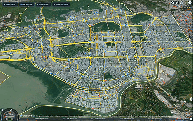
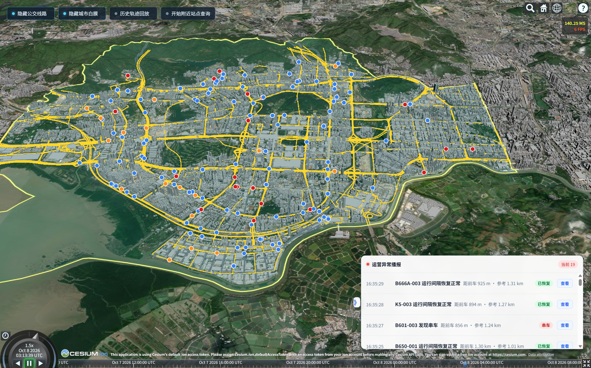
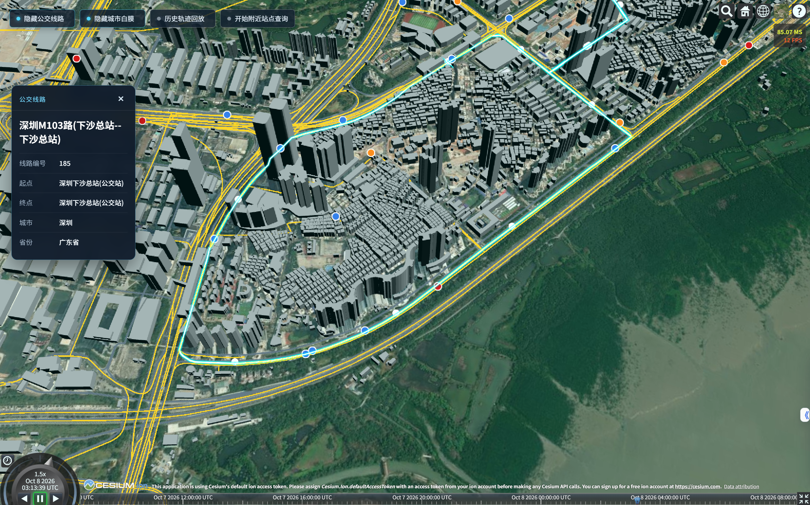
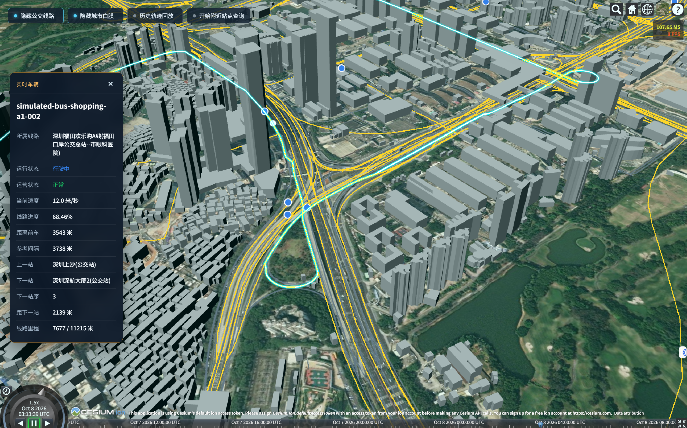
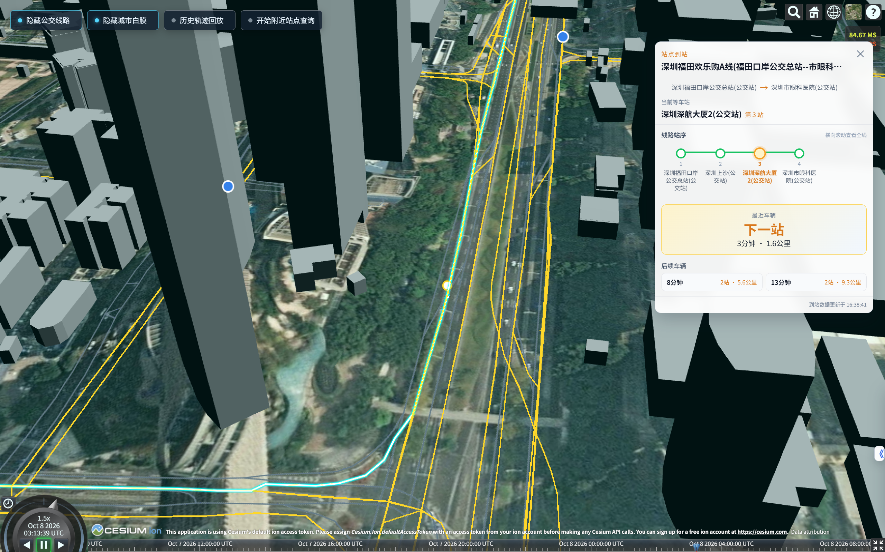
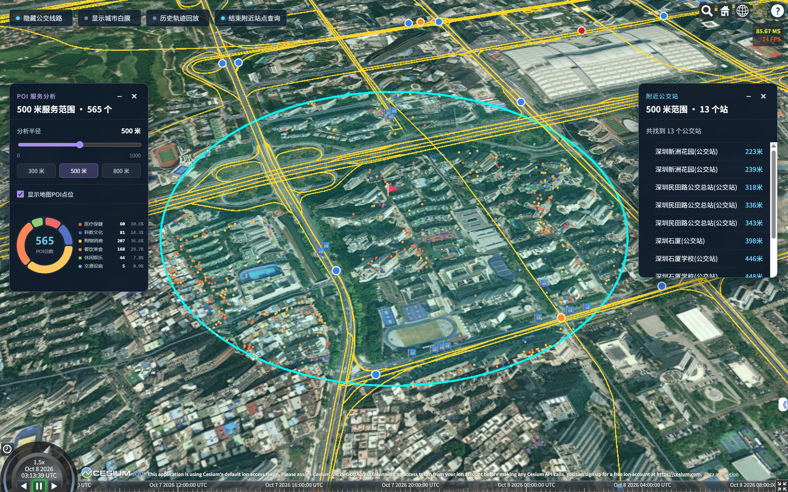
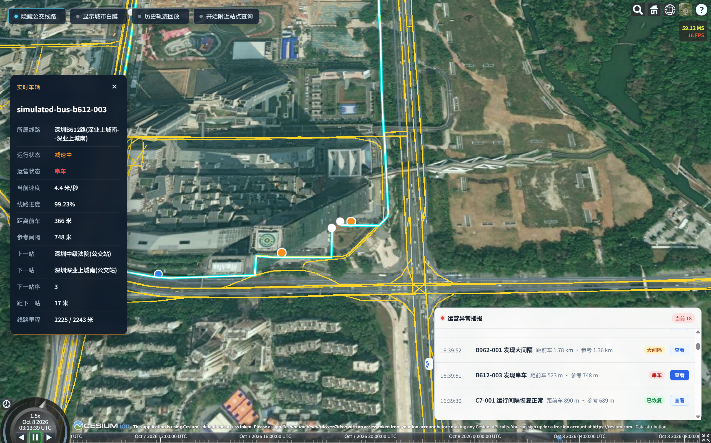
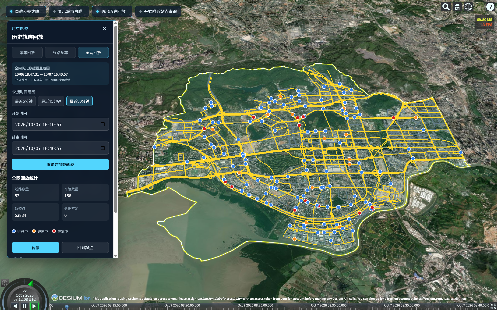
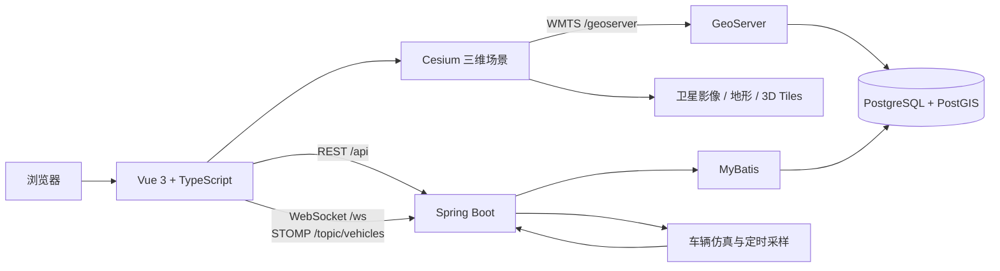

# Smart Transit WebGIS

基于 Cesium、Vue 3、Spring Boot 与 PostGIS 构建的三维智慧公交 WebGIS。项目以深圳市福田区为展示区域，将公交线路、站点、实时车辆、到站预测、运营异常、周边 POI 和历史轨迹统一呈现在三维地图中。

<p align="center">
  
</p>

<p align="center">
  
  
  
  
  
</p>

## 项目亮点

- 三维公交场景：叠加卫星影像、福田行政区边界、城市白膜、道路 WMTS、公交线路和站点。
- 实时车辆仿真：后端按线路里程推进车辆，通过 WebSocket/STOMP 每秒广播车辆快照，前端进行平滑插值。
- 公交业务联动：支持线路选中高亮、站序展示、车辆详情以及站点到站预测。
- 运营状态分析：根据车辆实际间隔识别串车和大间隔，并记录状态发现与恢复事件。
- 站点服务分析：以地图点击位置为中心查询附近公交站和 POI，支持 300、500、800 米常用半径及六类 POI 统计。
- 时空轨迹回放：支持单车、线路多车和全网三种历史回放模式，可调节倍速并跟随指定车辆。
- 空间数据库支撑：使用 PostGIS 保存线路、站点、道路、POI 和车辆历史位置，建立 GiST 空间索引。

## 功能展示

### 三维公交总览

福田区行政边界、道路网络、城市白膜、公交线路和实时车辆在同一场景中联动展示。车辆颜色用于区分行驶中、减速中和停靠中等运行状态。



### 线路查询与高亮

点击地图中的公交线路即可高亮完整线路，并查看线路编号、起终点、城市和省份等属性。



### 实时车辆监控

选择车辆后可查看所属线路、运行状态、运营状态、当前速度、线路进度、前车间距、上下站点和线路里程等信息。



### 站点到站预测

在线路站点上查看最近车辆与后续车辆的预计到站时间、剩余站数和距离；到站面板默认每 2 秒自动刷新。



### 附近站点与 POI 服务分析

点击地图即可在指定半径内检索公交站，并统计医疗保健、科教文化、购物消费、餐饮美食、休闲娱乐和交通设施六类 POI。分类图表与地图点位支持联动筛选。



### 运营异常播报

系统根据同线路车辆间距识别串车和大间隔，保留异常发现及恢复记录，并可从播报面板快速定位对应车辆。



### 历史轨迹回放

车辆位置默认每 5 秒采样，保留最近 3 天数据。回放支持单车、线路多车和全网模式，可选择时间范围、切换 1×/2×/5×/10× 倍速以及开启镜头跟随。



## 系统架构



实时数据链路：

```text
车辆仿真任务 → 车辆运行时状态 → STOMP 广播 → 前端位置插值 → Cesium 实时渲染
                                      ↓
                              PostGIS 历史位置采样
```

## 技术栈

| 层级 | 技术 |
|---|---|
| 前端框架 | Vue 3、TypeScript、Vite |
| 三维 GIS | CesiumJS、GeoJSON、3D Tiles、WMTS |
| 数据可视化 | Apache ECharts |
| 实时通信 | WebSocket、STOMP |
| 后端 | Java 17、Spring Boot、Spring Web MVC |
| 数据访问 | MyBatis |
| 数据库 | PostgreSQL 14、PostGIS 3.5 |
| 地图服务 | GeoServer 2.28、GeoWebCache |
| 本地基础设施 | Docker Compose |

## 数据规模

完整数据导入后的预期规模如下：

| 数据 | 数量 | 空间类型 |
|---|---:|---|
| 公交线路 | 616 | MultiLineString / EPSG:4326 |
| 公交站点 | 4,934 | Point / EPSG:4326 |
| 线路—站点关系 | 4,934 | 非空间关系表 |
| 城市道路 | 2,941 | MultiLineString / EPSG:4326 |
| POI | 36,366 | Point / EPSG:4326 |
| 仿真线路 | 52 | — |
| 仿真车辆 | 156 | 实时位置与历史轨迹 |

## 目录结构

```text
smart-transit-webgis/
├── backend/                  # Spring Boot 后端
│   └── src/main/
│       ├── java/             # Controller、Service、仿真与 WebSocket
│       └── resources/        # application.yml 与 MyBatis XML
├── database/                 # 建表、数据导入、索引与验证脚本
├── docs/
│   ├── images/               # README 截图与 GIF
│   └── performance/          # 车辆仿真性能记录
├── frontend/                 # Vue 3 + Cesium 前端
│   ├── public/               # 边界、线路、道路与站点数据
│   └── src/
│       ├── components/       # 业务信息面板
│       ├── composables/      # 地图图层和业务逻辑
│       ├── config/           # Cesium 与公交业务配置
│       ├── types/            # TypeScript 类型
│       └── views/            # 三维地图页面
├── .env.example              # Docker 环境变量模板
└── docker-compose.yml        # PostGIS 与 GeoServer
```

## 快速开始

### 1. 环境要求

- Node.js 20.19+ 或 22.12+
- npm 10+
- Java 17+
- Docker Desktop / Docker Compose
- 可选：QGIS，用于导入道路和完整 POI 数据
- 可访问外部地形、影像和 3D Tiles 服务的网络环境

### 2. 配置本地密码

在项目根目录复制环境变量模板：

```powershell
Copy-Item .env.example .env
```

编辑 `.env`，将示例值替换为本机密码：

```dotenv
SMART_TRANSIT_DB_PASSWORD=your-local-database-password
GEOSERVER_ADMIN_PASSWORD=your-local-geoserver-password
```

`.env` 已被 Git 忽略，请勿提交真实密码。

### 3. 启动 PostGIS 与 GeoServer

```powershell
docker compose up -d
docker compose ps
```

服务地址：

| 服务 | 地址 |
|---|---|
| PostgreSQL/PostGIS | `127.0.0.1:15433` |
| GeoServer | `http://localhost:8081/geoserver` |

### 4. 初始化数据库

以下 PowerShell 命令会导入仓库内可直接复现的线路和站点数据，并创建道路、POI 与历史轨迹表：

```powershell
$scripts = @(
  'create_schema.sql',
  'create_indexes.sql',
  'import_routes_raw.sql',
  'load_routes.sql',
  'load_stops_and_route_stops.sql',
  'add_vehicle_position_history.sql',
  'create_city_roads.sql',
  'create_pois.sql',
  'verify_database.sql'
)

foreach ($script in $scripts) {
  Get-Content -Raw ".\database\$script" |
    docker compose exec -T postgis psql `
      -v ON_ERROR_STOP=1 `
      -U smart_transit `
      -d smart_transit
}
```

基础线路、站点和车辆仿真可以直接使用仓库数据。城市道路的原始 GeoJSON 位于 `frontend/public/test-data/futian-bus-roads.geojson`，完整 POI 原始数据未提交到仓库；二者的 QGIS 导入步骤请参阅 [`database/README.md`](database/README.md)。

### 5. 配置 GeoServer 道路图层（可选）

要显示灰色城市道路 WMTS，需要在 GeoServer 中完成以下配置：

1. 创建工作区 `smart_transit`。
2. 创建 PostGIS 数据存储，容器内数据库地址为 `postgis:5432`，数据库和用户名均为 `smart_transit`。
3. 发布 `public.city_roads`，图层名保持为 `smart_transit:city_roads`。
4. 创建并指定样式 `smart_transit:city_roads_style`。
5. 在 Tile Caching 中启用 `EPSG:900913` 和 PNG 输出。

当前仓库未包含 GeoServer 数据目录及道路 SLD，因此这部分需要在本机配置。未配置时核心公交功能仍可运行，但道路 WMTS 不会显示。

### 6. 启动后端

打开新的 PowerShell 窗口：

```powershell
cd backend
$env:SMART_TRANSIT_DB_PASSWORD = 'your-local-database-password'
.\mvnw.cmd spring-boot:run
```

后端默认运行在 `http://localhost:8080`。启动后会按配置为 52 条线路生成 156 辆模拟车辆。

### 7. 启动前端

再打开一个 PowerShell 窗口：

```powershell
cd frontend
npm ci
npm run dev
```

浏览器访问 `http://localhost:5173`。Vite 开发服务器会将 `/api` 和 `/ws` 代理到后端，将 `/geoserver` 代理到 GeoServer。

## 使用方式

1. 点击地图线路，查看线路详情和完整线路高亮。
2. 点击彩色车辆点，查看实时运行与运营状态。
3. 选中线路后点击站点，查看站序及到站预测。
4. 点击“开始附近站点查询”，再点击地图位置，查看站点和 POI 服务范围。
5. 点击“历史轨迹回放”，选择单车、线路多车或全网模式并设置时间范围。
6. 在“运营异常播报”中点击“查看”，定位发生串车或大间隔的车辆。

> 历史回放需要后端先运行一段时间并积累采样数据。刚完成首次启动时，历史数据列表可能为空。

## API 概览

| 方法 | 路径 | 说明 |
|---|---|---|
| GET | `/api/routes` | 查询全部线路 |
| GET | `/api/routes/geojson` | 获取线路 GeoJSON |
| GET | `/api/routes/{routeId}/stops` | 查询线路有序站点 |
| GET | `/api/stops` | 查询全部站点 |
| GET | `/api/stops/nearby` | 查询指定坐标附近站点 |
| GET | `/api/stops/{stopId}/arrivals` | 查询指定线路的站点到站预测 |
| GET | `/api/pois/nearby` | 查询指定范围内 POI 明细 |
| GET | `/api/pois/summary` | 统计指定范围内 POI 分类 |
| GET | `/api/vehicles/current` | 查询当前车辆快照 |
| GET | `/api/vehicles/history/availability` | 查询历史数据可用范围 |
| GET | `/api/vehicles/history/{vehicleId}/trajectory` | 查询单车历史轨迹 |
| GET | `/api/vehicles/history/routes/{routeId}/trajectories` | 查询线路多车轨迹 |
| GET | `/api/vehicles/history/network/trajectories` | 查询全网同步轨迹 |
| WS/STOMP | `/ws` → `/topic/vehicles` | 订阅实时车辆快照 |

历史查询时间使用 ISO-8601 UTC 格式，单次查询范围最长为 120 分钟。

## 核心配置

- 后端数据库、车辆仿真和历史采样：`backend/src/main/resources/application.yml`
- 前端接口、查询半径和回放倍速：`frontend/src/config/transit.config.ts`
- 地形、白膜与行政区边界：`frontend/src/config/cesium.config.ts`
- 本地代理与 Cesium 静态资源：`frontend/vite.config.ts`
- GeoServer WMTS 图层参数：`frontend/src/composables/useCityRoadWmtsLayer.ts`

## 构建与测试

前端生产构建：

```powershell
cd frontend
npm run build
```

后端测试：

```powershell
cd backend
.\mvnw.cmd test
```

数据库验证：

```powershell
Get-Content -Raw .\database\verify_database.sql |
  docker compose exec -T postgis psql -U smart_transit -d smart_transit
```