# Smart Transit WebGIS

基于 Cesium、Vue 3、Spring Boot 与 PostGIS 构建的三维智慧公交 WebGIS。项目以深圳市福田区为展示区域，将公交线路、站点、实时车辆、到站预测、运营异常、周边 POI 与历史轨迹统一组织在一个地图工作台中。

系统当前可同时模拟 **304 条线路、912 辆公交车**。前端根据观察距离在三维模型、点图元和地理网格之间自动切换，并通过视野裁剪与平滑插值兼顾区域总览性能和近景业务表现。

<p align="center">
  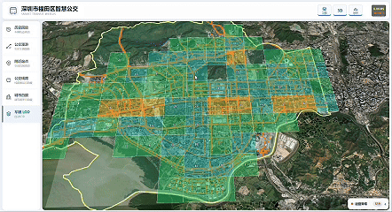
</p>

<p align="center">
  
  
  
  
  
</p>

## 项目亮点

- **一体化地图工作台**：使用顶部视图控制、左侧功能导航、右侧上下文工作台和底部线路站序组织复杂公交业务，面板只在需要时占用地图空间。
- **区域级车辆仿真**：后端按线路里程推进 304 条线路上的 912 辆公交车，通过 WebSocket/STOMP 每秒广播一次车辆快照。
- **分级车辆渲染**：近景使用三维公交模型，中景使用 `PointPrimitiveCollection`，远景按 1 千米地理网格聚合车辆密度。
- **实时渲染优化**：自动 LOD 使用进入/退出阈值减少频繁切换，并结合带缓冲区的视野裁剪，仅更新当前视野附近的车辆。
- **平滑实时动画**：前端在相邻服务端快照间进行位置和业务指标插值，降低周期性跳动并保持车辆沿线连续运行。
- **公交轨迹漫游**：支持从地图或车辆详情进入实时跟车视角，高亮车辆所属线路，并在底部展示已通过、上一站、下一站和后续站点。
- **三维公交设施**：近景显示带朝向的公交车模型、线路/车辆标签以及三维公交站牌，选中对象会获得轮廓高亮。
- **公交业务联动**：线路、车辆、站点、到站预测与运营异常相互联动，可从面板直接定位地图对象。
- **运营状态分析**：根据同线路车辆的实际间隔识别串车和大间隔，持续记录异常发现与恢复事件。
- **站点服务分析**：以地图点击位置为中心查询附近公交站和 POI，支持 300、500、800 米常用半径及六类 POI 统计。
- **时空轨迹回放**：支持单车、线路多车和全网三种历史回放模式，可调节倍速并跟随指定车辆。
- **多种地图视图**：支持卫星影像与 OSM 道路图切换、二维/三维场景切换以及地形开关。
- **空间数据库支撑**：使用 PostGIS 保存线路、站点、道路、POI 与车辆历史位置，并建立 GiST 空间索引。

## 功能展示

### 三维公交总览与自动 LOD

福田区行政边界、道路网络、公交线路和实时车辆在同一场景中联动展示。远距离观察时，车辆会自动聚合为带数量和颜色分级的地理网格；降低相机高度后，系统依次切换到点PointPrmitive和三维glb模型。

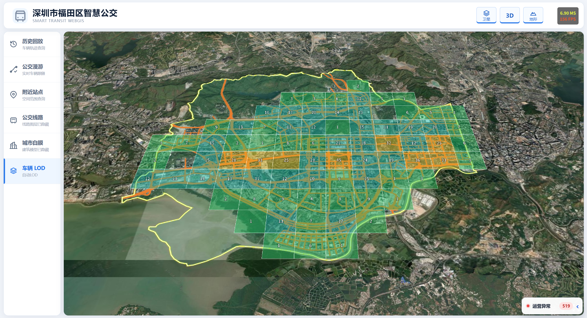

### 线路查询与站点高亮

点击地图中的公交线路即可高亮完整线路，并在右侧工作台查看线路编号、起终点、城市和省份等属性。线路站点使用带名称标签的三维站牌表示。

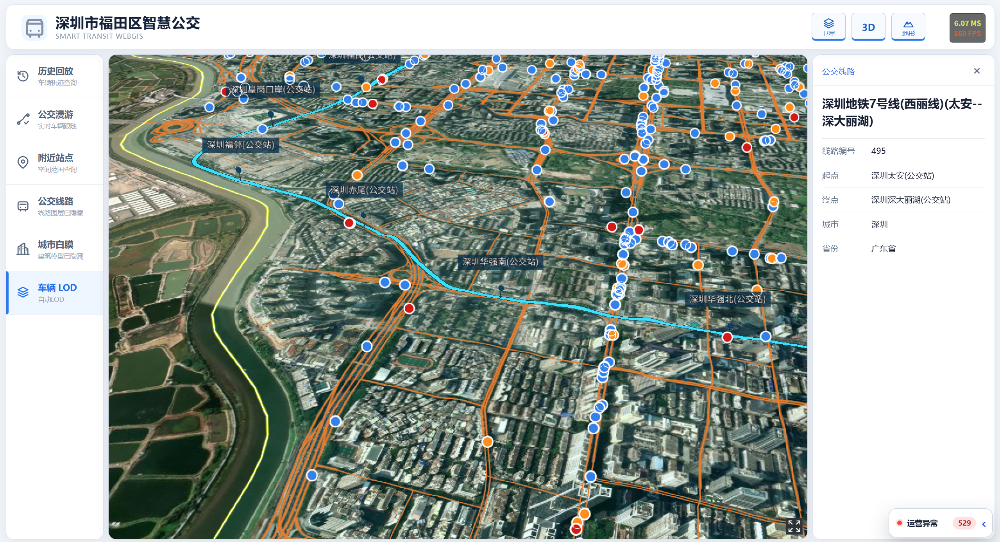

### 实时车辆监控

进入近景后，车辆由点图元自动切换为带朝向的三维公交模型。选择车辆可查看所属线路、行驶与运营状态、上下站点、当前速度和前车间隔，并可直接开始实时追踪。

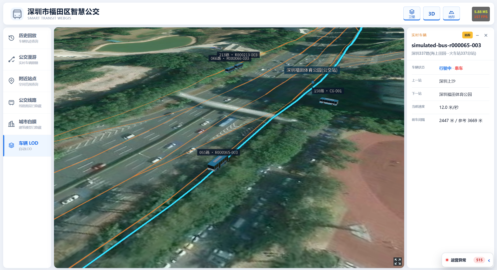

### 实时公交轨迹漫游

公交漫游模式会持续跟随选中的实时车辆，高亮其运行线路，并在地图底部展示完整站序。站序面板实时标记已通过站点、上一站、下一站、车辆在线路中的位置及距下一站距离。

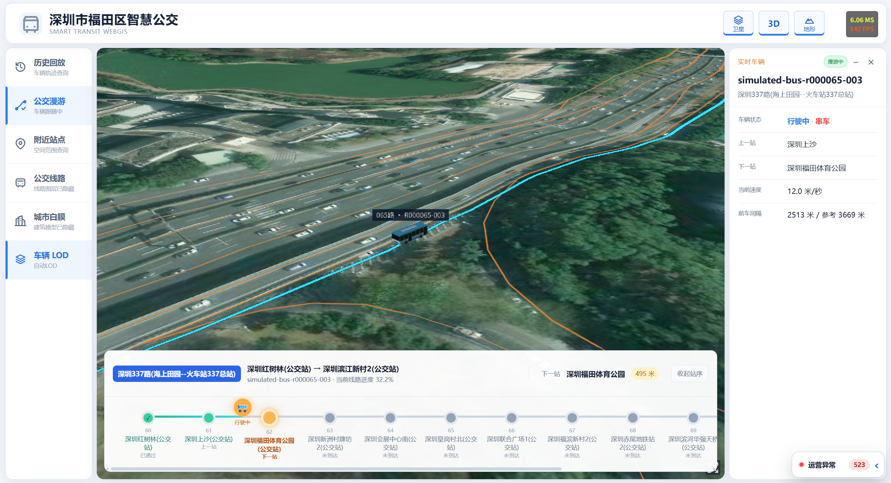

### 站点到站预测

选择线路上的站牌后，可查看当前站序、最近车辆与后续车辆的预计到站时间、剩余站数和距离。到站数据默认每 2 秒自动刷新，并可从候车列表直接定位车辆。

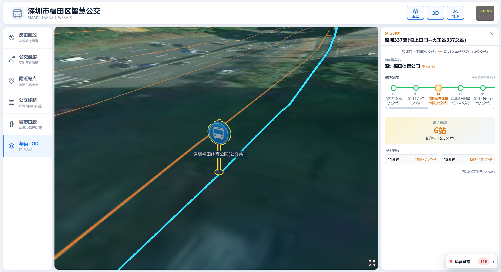

### 附近站点与 POI 服务分析

点击地图即可在指定半径内检索公交站，并统计医疗保健、科教文化、购物消费、餐饮美食、休闲娱乐和交通设施六类 POI。分类图表、地图点位与站点列表支持联动筛选，半径可通过滑动条或 300、500、800 米快捷值调整。

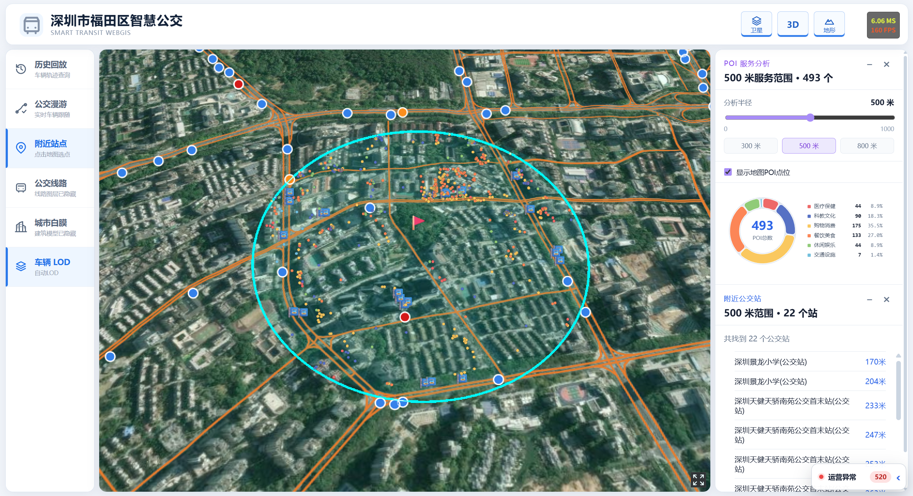

### 运营异常播报

系统根据同线路车辆的实际间隔识别串车和大间隔，保留异常发现及恢复记录。异常播报面板支持折叠，也可通过“查看”快速定位对应车辆和线路。

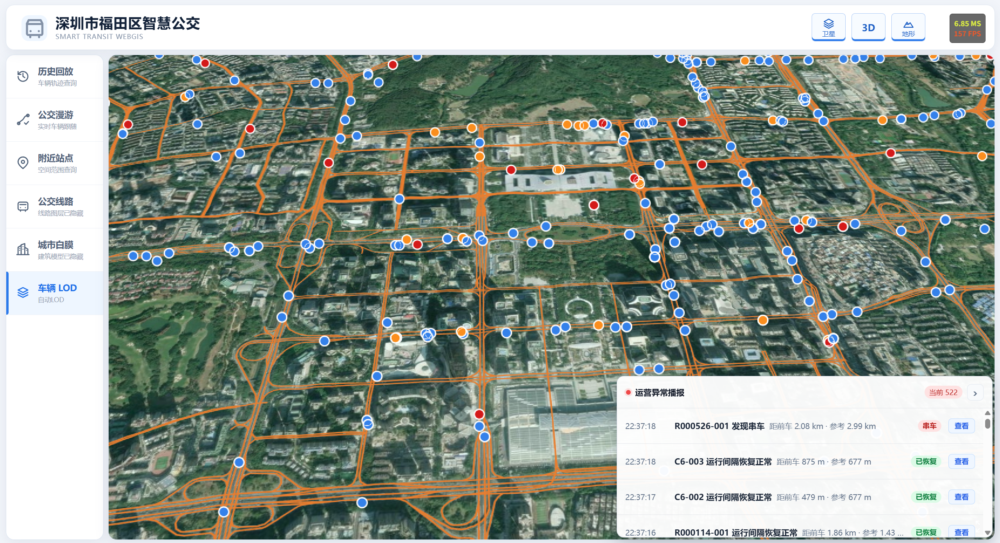

### 历史轨迹回放

车辆位置默认每 5 秒采样并保留最近 1 天数据。回放支持单车、线路多车和全网模式，可选择时间范围、切换 1×/2×/5×/10× 倍速、拖动 Cesium 时间轴，并选择车辆进行镜头跟随。

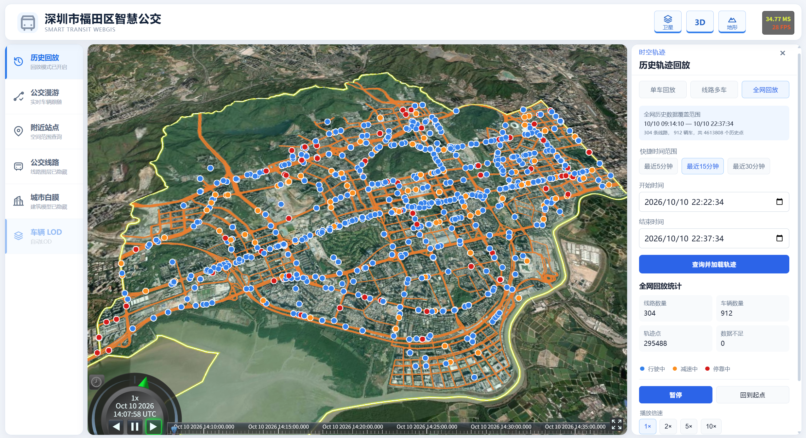

下面的动图演示了从公交总览进入历史回放、选择单车轨迹并开启镜头跟随的完整过程。

<p align="center">
  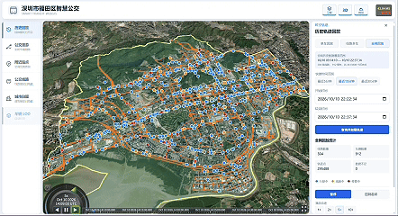
</p>

## 系统架构

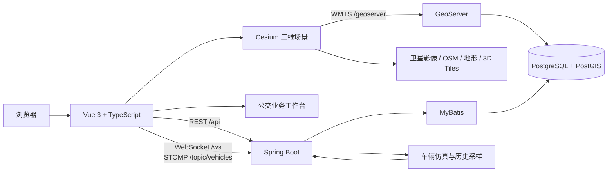

实时车辆链路：

```text
车辆仿真任务
    → 车辆运行时状态
    → STOMP 每秒广播
    → 前端快照插值
    → 视野裁剪
    → 自动 LOD：三维模型 / 点图元 / 地理网格
    → Cesium 实时渲染

车辆运行时状态
    → 每 5 秒批量采样
    → PostGIS 历史位置表
    → 单车 / 线路 / 全网轨迹查询与回放
```

## 实时车辆渲染策略

前端提供“自动 LOD”“全部点”和“全部模型”三种显示模式，便于在正常使用和渲染调试之间切换。自动模式按照相机状态选择合适的表现层：

| 场景 | 表现方式 | 当前阈值 |
|---|---|---|
| 近距离观察 | 三维公交模型与车辆标签 | 进入 800 米，离开 1000 米 |
| 中距离观察 | Cesium 点图元 | 模型范围之外、网格聚合范围之内 |
| 区域级总览 | 1 千米地理网格聚合 | 相机高度达到 3500 米进入，降至 2500 米退出 |

进入和退出阈值不相同，用于避免相机处于临界位置时车辆表现反复切换。视野裁剪会在屏幕边界外保留 15% 缓冲区域，使车辆进入画面时更加平滑。网格颜色按照车辆数量固定分级，便于比较不同位置和时刻的真实密度。

## 技术栈

| 层级 | 技术 |
|---|---|
| 前端框架 | Vue 3、TypeScript、Vite |
| 三维 GIS | CesiumJS、GeoJSON、3D Tiles、WMTS |
| 数据可视化 | Apache ECharts |
| 实时通信 | WebSocket、STOMP |
| 后端 | Java 17、Spring Boot、Spring Web MVC |
| 数据访问 | MyBatis |
| 数据库 | PostgreSQL 14、PostGIS 3.5 |
| 地图服务 | GeoServer 2.28、GeoWebCache |
| 本地基础设施 | Docker Compose |

## 数据规模

完整数据导入及当前仿真配置的规模如下：

| 数据 | 数量 | 说明 |
|---|---:|---|
| 公交线路 | 616 | `MultiLineString`，EPSG:4326 |
| 公交站点记录 | 4,934 | `Point`，EPSG:4326 |
| 线路—站点关系 | 4,934 | 带线路内站序 |
| 城市道路 | 2,941 | `MultiLineString`，EPSG:4326 |
| POI | 36,366 | `Point`，六类服务设施 |
| 仿真线路 | 304 | 每条线路默认生成 3 辆车 |
| 仿真车辆 | 912 | 实时位置、运行状态与历史轨迹 |

## 目录结构

```text
smart-transit-webgis/
├── backend/                  # Spring Boot 后端
│   └── src/main/
│       ├── java/             # Controller、Service、仿真与 WebSocket
│       └── resources/        # application.yml 与 MyBatis XML
├── database/                 # 建表、数据导入、空间索引与验证脚本
├── docs/
│   ├── images/               # README 截图与 GIF
│   └── performance/          # 车辆仿真性能记录
├── frontend/                 # Vue 3 + Cesium 前端
│   ├── public/
│   │   ├── data/             # 公交站点与线路关系数据
│   │   ├── models/           # 公交车与公交站牌 GLB 模型
│   │   └── test-data/        # 边界、线路、道路与站点数据
│   └── src/
│       ├── components/       # 业务工作台和信息面板
│       ├── composables/      # 地图图层、实时车辆与业务逻辑
│       ├── config/           # Cesium 与公交业务配置
│       ├── types/            # TypeScript 类型
│       └── views/            # 三维公交地图页面
├── .env.example              # Docker 环境变量模板
└── docker-compose.yml        # PostGIS 与 GeoServer
```

## 快速开始

### 1. 环境要求

- Node.js 20.19+ 或 22.12+
- npm 10+
- Java 17+
- Docker Desktop / Docker Compose
- 可选：QGIS，用于导入道路和完整 POI 数据
- 可访问外部地形、影像、OSM 与 3D Tiles 服务的网络环境

### 2. 配置本地密码

在项目根目录复制环境变量模板：

```powershell
Copy-Item .env.example .env
```

编辑 `.env`，将示例值替换为本机密码：

```dotenv
SMART_TRANSIT_DB_PASSWORD=your-local-database-password
GEOSERVER_ADMIN_PASSWORD=your-local-geoserver-password
```

`.env` 已被 Git 忽略，请勿提交真实密码。

### 3. 启动 PostGIS 与 GeoServer

```powershell
docker compose up -d
docker compose ps
```

| 服务 | 地址 |
|---|---|
| PostgreSQL/PostGIS | `127.0.0.1:15433` |
| GeoServer | `http://localhost:8081/geoserver` |

### 4. 初始化数据库

以下 PowerShell 命令会导入仓库内可直接复现的线路和站点数据，并创建道路、POI 与历史轨迹表：

```powershell
$scripts = @(
  'create_schema.sql',
  'create_indexes.sql',
  'import_routes_raw.sql',
  'load_routes.sql',
  'load_stops_and_route_stops.sql',
  'add_vehicle_position_history.sql',
  'create_city_roads.sql',
  'create_pois.sql',
  'verify_database.sql'
)

foreach ($script in $scripts) {
  Get-Content -Raw ".\database\$script" |
    docker compose exec -T postgis psql `
      -v ON_ERROR_STOP=1 `
      -U smart_transit `
      -d smart_transit
}
```

基础线路、站点和车辆仿真可以直接使用仓库数据。城市道路原始 GeoJSON 位于 `frontend/public/test-data/futian-bus-roads.geojson`，完整 POI 原始数据未提交到仓库；二者的 QGIS 导入步骤请参阅 [`database/README.md`](database/README.md)。

### 5. 配置 GeoServer 道路图层（可选）

如需显示城市道路 WMTS，请在 GeoServer 中完成以下配置：

1. 创建工作区 `smart_transit`。
2. 创建 PostGIS 数据存储，容器内数据库地址为 `postgis:5432`，数据库和用户名均为 `smart_transit`。
3. 发布 `public.city_roads`，图层名保持为 `smart_transit:city_roads`。
4. 创建并指定样式 `smart_transit:city_roads_style`。
5. 在 Tile Caching 中启用 `EPSG:900913` 和 PNG 输出。

当前仓库未包含 GeoServer 数据目录及道路 SLD，因此这部分需要在本机配置。未配置时核心公交功能仍可运行，但道路 WMTS 不会显示。

### 6. 启动后端

打开新的 PowerShell 窗口：

```powershell
cd backend
$env:SMART_TRANSIT_DB_PASSWORD = 'your-local-database-password'
.\mvnw.cmd spring-boot:run
```

后端默认运行在 `http://localhost:8080`，并按照当前配置为 304 条线路生成 912 辆模拟车辆。首次启动后需要等待一段时间，历史轨迹查询才会有可用数据。

### 7. 启动前端

再打开一个 PowerShell 窗口：

```powershell
cd frontend
npm ci
npm run dev
```

浏览器访问 `http://localhost:5173`。Vite 开发服务器会将 `/api` 和 `/ws` 代理到后端，将 `/geoserver` 代理到 GeoServer。

## 使用方式

1. 使用顶部按钮切换卫星/OSM 底图、二维/三维场景以及地形/平面模式。
2. 使用左侧“公交线路”“城市白膜”和“车辆 LOD”控制地图图层与车辆表现。
3. 点击地图线路，在右侧查看线路详情和完整线路高亮。
4. 降低相机高度后点击三维公交车，在右侧查看实时运行状态。
5. 点击车辆面板中的“追踪”，或先进入“公交漫游”再选择车辆，开启实时跟车和底部站序进度。
6. 在线路高亮后点击三维站牌，查看站序以及最近和后续车辆的到站预测。
7. 点击“附近站点”后在地图选点，查看公交站和 POI 服务范围，可调整查询半径并筛选 POI 分类。
8. 展开“运营异常播报”，点击事件后的“查看”定位发生串车或大间隔的车辆。
9. 点击“历史回放”，选择单车、线路多车或全网模式，设置时间范围后加载轨迹并控制播放。

> 历史轨迹默认每 5 秒采样一次，仅保留最近 1 天；单次查询时间范围最长为 120 分钟。刚完成首次启动时，历史数据列表可能为空。

## API 概览

| 方法 | 路径 | 说明 |
|---|---|---|
| GET | `/api/routes` | 查询全部线路属性 |
| GET | `/api/routes/geojson` | 获取线路 GeoJSON |
| GET | `/api/routes/{routeId}/stops` | 查询指定线路的有序站点 |
| GET | `/api/route-stops` | 查询线路—站点关系 |
| GET | `/api/stops` | 查询全部站点 |
| GET | `/api/stops/nearby` | 查询指定坐标附近的公交站 |
| GET | `/api/stops/{stopId}/arrivals` | 查询指定线路的站点到站预测 |
| GET | `/api/pois/nearby` | 查询指定范围内的 POI 明细 |
| GET | `/api/pois/summary` | 统计指定范围内的 POI 分类 |
| GET | `/api/vehicles/current` | 查询当前车辆快照 |
| GET | `/api/vehicles/history/availability` | 查询历史数据可用范围 |
| GET | `/api/vehicles/history/{vehicleId}/trajectory` | 查询单车历史轨迹 |
| GET | `/api/vehicles/history/routes/{routeId}/trajectories` | 查询线路多车轨迹 |
| GET | `/api/vehicles/history/network/trajectories` | 查询全网同步轨迹 |
| WS/STOMP | `/ws` → `/topic/vehicles` | 订阅实时车辆快照 |

历史查询时间使用 ISO-8601 UTC 格式。

## 核心配置

- 后端数据库、304 条仿真线路、车辆速度、运营异常阈值和历史采样：`backend/src/main/resources/application.yml`
- 前端接口、POI 半径、回放倍速、车辆模型与 LOD 阈值：`frontend/src/config/transit.config.ts`
- 底图、地形、白膜、行政边界与 FPS 调试开关：`frontend/src/config/cesium.config.ts`
- 本地代理与 Cesium 静态资源：`frontend/vite.config.ts`
- GeoServer WMTS 图层参数：`frontend/src/composables/useCityRoadWmtsLayer.ts`

## 构建与测试

前端生产构建：

```powershell
cd frontend
npm run build
```

后端测试：

```powershell
cd backend
.\mvnw.cmd test
```

数据库验证：

```powershell
Get-Content -Raw .\database\verify_database.sql |
  docker compose exec -T postgis psql -U smart_transit -d smart_transit
```
